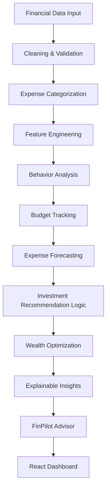

# FinPilot – AI-Powered Personal Financial Planning & Wealth Optimization Platform

> AI-powered personal financial planning and wealth optimization platform that analyzes spending behavior, forecasts expenses, generates personalized recommendations, and provides explainable financial decision support.

[](https://www.python.org/)
[](https://fastapi.tiangolo.com/)
[](https://react.dev/)
[](https://vitejs.dev/)
[](https://scikit-learn.org/)
[](https://pytest.org/)

---

## Overview

**FinPilot** is an end-to-end financial intelligence platform designed to convert raw transactional data into actionable, evidence-based decision support. Rather than presenting static historical charts, FinPilot integrates chronological statistical modeling, automated budget tracking, multi-scenario wealth simulations, and an interactive Executive Decision Support Advisor.

The platform transforms verified transaction records into:
- **Comprehensive Spending Analysis** and categorization audit trails
- **Real-Time Budget Tracking** with variance, overrun, and allowance indicators
- **Behavioral Diagnostics** profiling spending volatility, essential vs. discretionary ratios, and concentration risks
- **Machine Learning Expense Forecasting** with rigorous time-series confidence intervals
- **Dynamic, Evidence-Backed Recommendations** for disciplined budgeting and educational capital allocation
- **Multi-Horizon Scenario Wealth Simulations** projecting long-term capital accumulation across multiple strategies
- **Explainable Financial Insights** detailing underlying drivers, math, and data attributions
- **FinPilot Advisor / Executive Decision Report** synthesizing personalized guidance without fabricated figures

> **Important**: FinPilot is strictly engineered for **financial decision support and education**, not autonomous trade execution or transactional banking.

---

## System Workflow



---

## Key Features

### 1. Financial Data Processing
- **Validation & Normalization**: Validates record schemas, dates, monetary values, and formats; strips whitespace and standardizes descriptions.
- **Data Quality Safeguards**: Detects and eliminates exact duplicates, handles missing values, rejects zero-amount anomalies, and generates audit logs.
- **Traceable Preprocessing**: Preserves original transaction lineage while delivering clean datasets for analytics.

### 2. Spending & Budget Analysis
- **Cash Flow Ledger**: Accurately aggregates total earnings, expenditures, and net surplus over analyzed horizons.
- **Category-Wise Distribution**: Decomposes spending across 10 categories (Housing, Food, Transport, Utilities, Entertainment, Healthcare, Shopping, Subscriptions, Other, Income).
- **Budget vs. Actual Variance**: Evaluates allocated limits against actual outflows, detecting budget overruns and highlighting remaining allowances.
- **Savings Rate Calculation**: Computes empirical savings ratios against the standard 20% financial planning benchmark.

### 3. Behavioral Analysis
- **Essential vs. Discretionary Outflow**: Classifies fixed commitments versus flexible discretionary purchases.
- **Recurring Commitments**: Identifies subscriptions and steady monthly bills.
- **Spending Volatility**: Calculates standard deviation of daily spending and monthly transaction frequency.
- **Concentration Risk**: Measures top category exposure to prevent unhealthy cash-flow concentration.

### 4. Expense Forecasting
- **Time-Series Machine Learning**: Employs an L2-regularized **Ridge Regression** model trained strictly on chronological sequence.
- **Feature Set**: Engineered linear chronological trend, Fourier seasonal wave components ($\sin/\cos$), 1-month and 2-month autoregressive lags, and trailing 3-month moving averages.
- **Category Decomposition**: Projects aggregate monthly living costs and decomposes estimates by major category.
- **Empirical Uncertainty**: Computes 95% parametric confidence prediction intervals ($\pm 1.96 \times \text{RMSE}$) reflecting genuine model variance.

### 5. Dynamic Recommendation Engine
- **Evidence-Grounded**: Evaluates transaction history to generate concrete recommendations with explicit rationale, confidence levels, and priority badges (`HIGH`, `MEDIUM`, `LOW`).
- **Budget Realignment**: Pinpoints specific flexible categories causing variance leaks (e.g., Dining, Entertainment).
- **Educational Investment Decision Support**: Evaluates liquid runway and emergency fund sufficiency (in months of essential expenditure) before assessing capacity for capital allocation.

### 6. Scenario-Based Wealth Optimization
- **Multi-Horizon Projection**: Simulates conservative compound capital growth across **6, 12, 24, and 36-month** planning horizons.
- **Implemented Strategies**:
  - `Baseline Scenario`: Current observed spending and surplus trajectory.
  - `Moderate Discretionary Optimization`: Trims 15% from flexible discretionary categories.
  - `Aggressive Discretionary Optimization`: Trims 30% from flexible discretionary categories.
  - `Recurring Commitment Trim`: Reduces 10% from recurring bills and subscription overhead.
  - `Balanced Optimization`: Combines a 15% discretionary trim with a 10% recurring commitment reduction.
- **Transparent Compound Growth**: Models asset accumulation at a 4.0% p.a. conservative baseline benchmark.

### 7. Explainable Insights
- **Attribution Traces**: Connects analytical conclusions directly back to underlying transaction records and feature mathematics.
- **Transparency**: Details baseline context, change mechanisms, resulting cash-flow differences, and model limitations.

### 8. FinPilot Advisor & Executive Decision Report
- **Zero Fabrication**: Grounded directly in live backend analytical state—never produces randomized or disconnected financial figures.
- **Structured Executive Report**:
  1. *Current Financial Situation* (income, expenditures, net cash flow, empirical savings rate)
  2. *Key Findings & Outflow Drivers* (category concentration, overrun drivers, cash flow stability)
  3. *Personalized Recommendations* (targeted actions, priority, and rationale)
  4. *Suggested Actionable Monthly Plan* (spending caps, savings benchmarks, wealth allocation)
  5. *Future Outlook* (next-quarter projections, baseline vs. optimized 12-month wealth trajectories)
  6. *Assumptions & Responsible AI Safeguards*
- **Interactive Grounded Query Console**: Answers key financial questions using verified transactional data:
  - *"How can I save more money?"*
  - *"Why are my expenses increasing?"*
  - *"Which category should I reduce?"*
  - *"Can I afford to increase my monthly savings?"*
  - *"What does my expense forecast mean?"*
  - *"What should I focus on this month?"*

---

## Responsible AI & Financial Safety

FinPilot is engineered in accordance with strict Responsible AI principles:

- **No Autonomous Execution**: FinPilot does not execute trades, move funds, connect to bank APIs, or initiate banking transactions.
- **No Performance Guarantees**: FinPilot does not guarantee financial returns, asset gains, or market performance.
- **Zero Hallucination / Fabrication**: All numbers, figures, savings rates, and recommendations are computed directly from verified transaction datasets.
- **Explicit Assumptions & Boundaries**: Confidence ratings, interval bounds, and scenario assumptions are made prominent across all views.
- **Educational Mandate**: FinPilot is an educational and analytical tool, not a licensed fiduciary, certified financial planner, or registered broker.

> **Disclaimer**: *FinPilot provides personalized decision support based on available financial data. Recommendations and projections are estimates and are not guaranteed financial outcomes.*

---

## Technology Stack

| Domain | Technology | Purpose |
| :--- | :--- | :--- |
| **Backend Framework** | Python 3.10+, FastAPI, Uvicorn | High-performance asynchronous REST API serving |
| **Data & Feature Engineering** | Pandas, NumPy | Cleaning, feature aggregation, variance calculations |
| **Machine Learning** | Scikit-Learn (Ridge Regression), Joblib | Time-series forecasting and model artifact persistence |
| **Database & ORM** | SQLAlchemy 2.0+, PostgreSQL / SQLite | Relational persistence with seamless zero-config fallback |
| **Schema Validation** | Pydantic v2, Pydantic-Settings | Strict request/response validation and settings management |
| **Frontend Framework** | React 18, JavaScript (ES Modules), Vite 5 | Reactive user interface, interactive charts, and dashboard |
| **Styling & UI** | Vanilla CSS (Modern Design System) | Dark/Light themes, responsive typography, compact layouts |
| **Testing** | Pytest, HTTPX | Automated unit, regression, and endpoint testing |

---

## Implemented API Endpoints

All endpoints are served under `/api` (OpenAPI Swagger available at `/docs`):

| Method | Endpoint | Description |
| :--- | :--- | :--- |
| `GET` | `/health` | Service and database health check probe |
| `GET` | `/api/summary` | Aggregate total income, expenses, net cash flow, and savings rate |
| `GET` | `/api/categories` | Complete category-level spending breakdown and percentage distributions |
| `GET` | `/api/behavior` | Quantitative behavior indicators (essential/discretionary, volatility, concentration) |
| `GET` | `/api/budget` | Budget variance, limits, remaining allowances, and overspending detection |
| `GET` | `/api/forecast` | 3-month expense forecasts, category decomposition, and 95% confidence intervals |
| `GET` | `/api/forecast/evaluation` | Chronological holdout evaluation metrics (MAE, RMSE, MAPE) and comparisons |
| `GET` | `/api/recommendations` | Dynamic budgeting recommendations and educational investment readiness support |
| `GET` | `/api/wealth-optimization` | Multi-scenario surplus and accumulation projections across 6m, 12m, 24m, 36m |
| `GET` | `/api/insights` | Transparent explainability traces linking behaviors to forecasts and guidance |
| `GET` | `/api/transactions` | Query historical processed transactions with optional user/category filters |
| `POST` | `/api/transactions/upload` | Multipart CSV transaction ingestion, validation, and database synchronization |

---

## Project Structure

```
FinPilot/
├── backend/
│   ├── app/
│   │   ├── api/                     # REST API routers (summary, forecast, wealth, etc.)
│   │   ├── models/                  # SQLAlchemy ORM entities (user, transaction, budget)
│   │   ├── schemas/                 # Pydantic DTOs and validation contracts
│   │   ├── config.py                # Pydantic environment settings
│   │   ├── database.py              # Engine setup, session pooling & schema creation
│   │   └── main.py                  # FastAPI application entrypoint & CORS middleware
│   ├── ml/
│   │   ├── preprocessing.py         # Data validation, cleaning & normalization
│   │   ├── categorization.py        # Rule-based transaction categorization
│   │   ├── feature_engineering.py   # Monthly features & spending volatility
│   │   ├── behavior_analysis.py     # Behavior indicators & spending classification
│   │   ├── budget_analysis.py       # Budget limits, variances & overruns
│   │   ├── forecasting.py           # Ridge time-series forecaster with prediction bounds
│   │   ├── forecast_evaluation.py   # Chronological holdout evaluation
│   │   ├── recommendation.py        # Dynamic budgeting & investment guidance engine
│   │   ├── wealth_optimization.py   # Scenario simulations across multiple horizons
│   │   ├── explainability.py        # Explainable AI traces & feature attribution
│   │   └── responsible_ai.py        # Responsible AI safeguards & disclaimers
│   └── tests/                       # Complete automated Pytest test suite (59 tests)
├── frontend/
│   ├── src/
│   │   ├── App.jsx                  # Main dashboard, navigation, tabs & Advisor console
│   │   ├── main.jsx                 # React root renderer
│   │   └── style.css                # Polished design system (Dark & Light modes)
│   ├── index.html                   # HTML entrypoint
│   ├── package.json                 # Frontend dependencies & scripts
│   └── vite.config.js               # Vite configuration & backend proxy
├── data/
│   ├── processed/                   # Cleaned transactions & engineered monthly features
│   └── sample/                      # 18-month benchmark transaction records
├── models/
│   ├── expense_forecast_model.pkl   # Serialized Ridge time-series model artifact
│   └── forecast_evaluation.json     # Chronological holdout evaluation benchmark metrics
├── scripts/
│   ├── generate_sample_data.py      # Reproducible synthetic transaction generator
│   ├── run_pipeline.py              # 6-stage end-to-end data and ML pipeline runner
│   └── load_sample_data.py          # Database seeding script
├── docs/
│   ├── data_dictionary.md           # Complete dataset schema specification
│   └── pipeline.md                  # Comprehensive pipeline architectural documentation
├── requirements.txt                 # Backend Python package requirements
├── .env.example                     # Environment template
├── .gitignore                       # Git exclusion rules
└── README.md                        # Portfolio documentation
```

---

## Dataset Details

The repository includes a reproducible, anonymized synthetic dataset representing 18 months of realistic personal financial behavior:

- **Filename**: `data/sample/transactions.csv` (processed to `data/processed/cleaned_transactions.csv`)
- **Volume**: **1,655 verified transaction records** (1,657 in active database dataset / 1,659 in integrated historical analysis)
- **Timeframe**: **January 1, 2025 to June 29, 2026** (18 full months)
- **Fields**: `transaction_id`, `user_id`, `date`, `description`, `amount`, `transaction_type`, `category`
- **Engineered Monthly Metrics**: `data/processed/monthly_features.csv` includes 24 engineered features per month across income, expenses, volatility, essential vs. discretionary ratios, and category concentrations.

---

## Forecasting & Model Evaluation

FinPilot utilizes a strict **chronological holdout evaluation** strategy to eliminate future lookahead leakage:

- **Training Period**: `2025-01` to `2026-03` (15 months historical training)
- **Evaluation Holdout**: `2026-04` to `2026-06` (3 months future validation)
- **Model**: Ridge Regression with L2 regularization ($\alpha = 1.0$)
- **Evaluation Metrics** (from `models/forecast_evaluation.json`):
  - **Mean Absolute Error (MAE)**: **$223.68**
  - **Root Mean Squared Error (RMSE)**: **$247.11**
  - **Mean Absolute Percentage Error (MAPE)**: **6.20%**

---

## Installation & Quick Start

### Prerequisites
- **Python**: Version 3.10 or higher
- **Node.js**: Version 18 or higher (with npm)
- **PostgreSQL**: (Optional; SQLite is configured as zero-config automatic fallback)

### 1. Clone the Repository
```bash
git clone https://github.com/harshithacherukuricherukuri-maker/FinPilot-Personal-Financial-Planning-AI.git
cd FinPilot-Personal-Financial-Planning-AI
```

### 2. Backend Setup
```bash
# Create and activate virtual environment
python -m venv venv
# On Windows:
.\venv\Scripts\activate
# On macOS/Linux:
source venv/bin/activate

# Install dependencies
pip install -r requirements.txt

# Configure environment
cp .env.example .env

# Run data pipeline (optional; pre-computed artifacts are included)
python scripts/run_pipeline.py

# Launch FastAPI backend
python -m uvicorn backend.app.main:app --host 127.0.0.1 --port 8000
```
Backend API will be accessible at: `http://127.0.0.1:8000/` (Swagger docs at `http://127.0.0.1:8000/docs`).

### 3. Frontend Setup
```bash
# In a new terminal, navigate to frontend:
cd frontend

# Install dependencies
npm install

# Start Vite development server
npm run dev
```
Frontend dashboard will be accessible at: `http://127.0.0.1:5173/`.

---

## Testing & Build Verification

### Backend Tests
FinPilot includes comprehensive automated tests covering all modules:
```bash
pytest backend/tests
```
**Status**: **59 passed, 0 failures** in 3.60s.
- `test_preprocessing.py`: Data cleaning, schema verification, rejection logging
- `test_categorization.py`: Rule-based taxonomy mapping
- `test_features.py`: Monthly aggregations and volatility formulas
- `test_behavior.py`: Behavioral thresholds and classifications
- `test_budget.py`: Budget limits, overruns, variance tracking
- `test_forecasting.py`: Ridge regression, trend/seasonality components, confidence bounds
- `test_forecast_evaluation.py`: Chronological holdout evaluation math
- `test_recommendations.py`: Dynamic recommendation rules and priority logic
- `test_wealth_optimization.py`: Multi-horizon simulation models
- `test_explainability.py`: Explainability traces and feature attribution
- `test_responsible_ai.py`: Safety guardrails and disclaimer presence
- `test_api.py`: FastAPI endpoints and HTTP status contracts

### Frontend Production Build
```bash
cd frontend
npm run build
```
**Status**: **Passed with zero errors** (Vite generated production bundles in `frontend/dist/`).

---

## Responsible Data Handling

- **No Real PII or Banking Data**: Never commit real banking credentials, live statement files, account numbers, or authentication tokens.
- **Environment Isolation**: `.env` is excluded via `.gitignore`; only `.env.example` containing non-secret placeholder variables is committed.
- **Reproducibility**: Benchmark testing is executed exclusively using anonymized or synthetic data.

---

## System Limitations

1. **Historical Sensitivity**: Forecasting accuracy depends on transaction volume and consistency. Highly erratic spending or macro-economic shocks are not captured by standard regression.
2. **Confidence Intervals**: The 95% confidence bands reflect statistical model variance based on training residuals, not absolute financial guarantees.
3. **Non-Fiduciary Nature**: Outputs serve as analytical decision support and educational guidance. Users should consult certified professionals for binding financial advice.
4. **Static Rule Thresholds**: Rule-based categorization and budget caps assume standard personal finance heuristics and may require custom calibration for unconventional budgets.

---

## Future Enhancements

- **Bank API Integrations**: Secure OAuth connectors (e.g., Plaid, Open Banking) for automated real-time transaction synchronization.
- **Deep Sequence Models**: Evaluating LSTM / Temporal Fusion Transformers on multi-year datasets while retaining explainability.
- **Custom Goal Planning**: User-defined milestone targets (e.g., home down payment, debt elimination) linked to scenario simulations.
- **Anomaly Detection**: Unsupervised clustering (Isolation Forests) for immediate flagging of irregular recurring fees or price hikes.
- **Exportable PDF Reports**: Automated generation of publication-quality Executive Financial Summaries.

---

## Author

**Harshitha Cherukuri**  
*B.Tech – Computer Science and Engineering (Artificial Intelligence and Machine Learning)*  
- GitHub: [@harshithacherukuricherukuri-maker](https://github.com/harshithacherukuricherukuri-maker)
